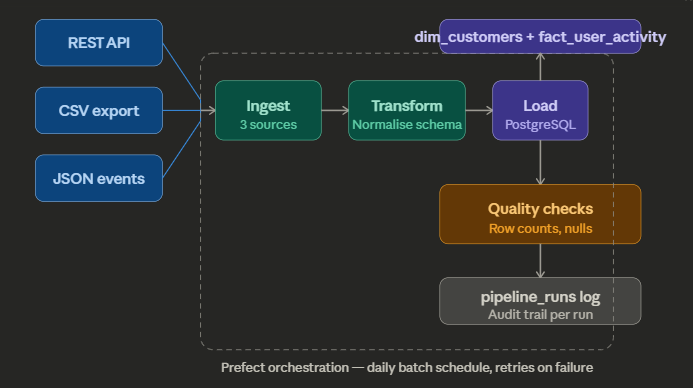
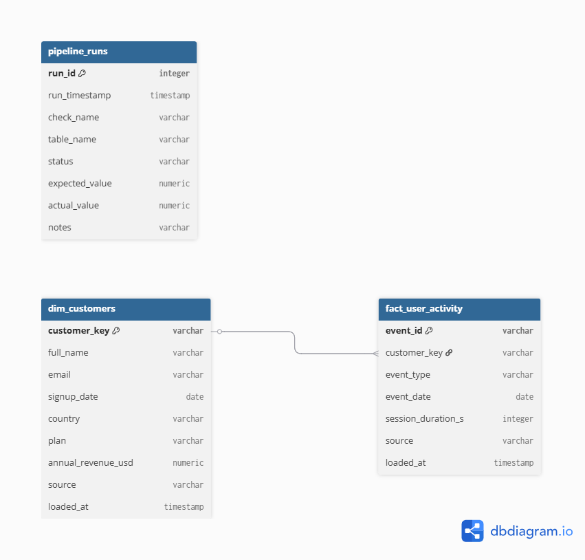

# Customer-360-Pipeline
A multi-source data integration pipeline that ingests customer data from heterogeneous sources, transforms it into a unified schema, loads it into a PostgreSQL data warehouse, and validates data quality orchestrated with Prefect for reliable daily batch execution.

# Overview
This project simulates a real-world data engineering challenge: a company running separate systems for CRM data, product usage tracking, and marketing each with inconsistent schemas, different ID conventions, and conflicting date formats. The pipeline unifies all three into a single analytics-ready Customer 360 table.
Built to demonstrate core data integration competencies: schema normalisation, ETL pipeline design, star schema modelling, data quality validation, and batch orchestration.

# Architecture


# Data Modelling


The warehouse is designed as a star schema with dim_customers as the central dimension table and fact_user_activity as the fact table, connected by customer_key as the foreign key relationship.

* dim_customers holds one row per unique customer, unified from two heterogeneous sources — a REST API and a legacy CSV export. The customer_key is the primary key and acts as the single identifier that all other tables reference. Supporting attributes describe who the customer is: their contact details, subscription plan, revenue value, signup date, and which source system they originated from. The source column is particularly important in a multi-source integration context because it preserves data lineage — you can always trace a record back to where it came from.
* fact_user_activity holds one row per product usage event, with each event linked back to a customer via customer_key. This is a many-to-one relationship — a single customer can generate hundreds of events over time, but each event belongs to exactly one customer. The fact table captures what happened (event_type), when it happened (event_date), and how long the session lasted (session_duration_s). Notably the foreign key is not enforced at the database level, which is a deliberate design decision — events generated by users who haven't yet been loaded into dim_customers would be rejected by a hard constraint, so referential integrity is instead handled at the application layer during reconciliation.
* pipeline_runs sits outside the star schema entirely and serves as the observability layer. It has no relationship to the customer data tables — its purpose is to log the outcome of every quality check executed after each pipeline run. Each row records which check ran, against which table, what the expected value was, what the actual value was, and whether it passed or failed. This table is what turns a pipeline into an auditable system — you can query it to see exactly when data quality degraded and which check caught it first.
Together the three tables reflect a separation of concerns that mirrors production data warehouse thinking: dimension data describes entities, fact data describes events, and operational metadata describes the pipeline itself.


## Key integration challenges solved
* Conflicting ID field names (user_id vs customerId vs id) unified into customer_key
* Inconsistent date formats (DD/MM/YYYY vs ISO 8601) standardised to YYYY-MM-DD
* Null handling across sources with different field coverage
* Star schema design separating customer profiles (dim_customers) from activity events (fact_user_activity)

# Tech Stack

| Layer                  | Technology              |
|------------------------|-------------------------|
| Language               | Python 3.13             |
| Data processing        | Pandas                  |
| Database               | PostgreSQL              |
| ORM / DB connection    | SQLAlchemy + psycopg2   |
| Orchestration          | Prefect                 |
| Data generation        | Faker                   |
| Environment management | python-dotenv           |

# Project Structure
```
customer360-pipeline/
├── ingestion/
│   ├── ingest_api.py        # REST API source (JSONPlaceholder)
│   ├── ingest_csv.py        # CSV legacy system source
│   └── ingest_events.py     # JSON product usage events
├── transform/
│   └── normalise.py         # Schema normalisation and unification
├── load/
│   ├── warehouse.py         # PostgreSQL connection and load functions
│   └── run_load.py          # End-to-end pipeline runner
├── quality/
│   └── checks.py            # Row count, null %, and logging to pipeline_runs
├── orchestration/
│   └── customer360_flow.py  # Prefect flow with task dependencies and retries
├── sql/
│   └── create_tables.sql    # Star schema DDL
├── generate_mock_data.py    # Synthetic data generator
├── requirements.txt
└── .env.example
```
# Pipeline Layers
* Ingestion pulls raw data from three sources — a live REST API, a CSV file simulating a legacy system export, and JSON event logs. Each ingestor returns a raw dataframe tagged with its source, with zero transformation applied at this stage.
* Transform resolves all schema inconsistencies across sources. ID fields are unified, date formats are standardised, nulls are handled, and irrelevant columns are dropped. The output is two clean dataframes: unified customer profiles and normalised usage events.
* Load writes both dataframes into a PostgreSQL star schema. dim_customers holds the unified customer profiles and fact_user_activity holds the usage events. The pipeline performs a full refresh on each run.
* Quality checks run automatically after every load and validate row counts against minimum thresholds and null percentages against column-level tolerances. Every check result is logged to a pipeline_runs table with a PASS/FAIL status and timestamp, creating a full audit trail.
* Orchestration wraps the entire pipeline in a Prefect flow with individual tasks for each layer. The API ingest task retries up to 3 times on failure. Task dependencies are explicitly declared so downstream tasks never run if an upstream task fails.

# Setup
```
git clone https://github.com/YOUR_USERNAME/customer360-pipeline.git
cd customer360-pipeline
python -m venv venv
venv\Scripts\activate        # Windows
pip install -r requirements.txt
cp .env.example .env         # Add your PostgreSQL credentials
python generate_mock_data.py
python -m load.run_load
```
## To run with prefrect orchestration
```
prefect server start         # In a separate terminal
python -m orchestration.customer360_flow
```
# Data Quality

Quality checks run automatically after each pipeline execution and log results to the `pipeline_runs` table:

| Check                     | Table               | Threshold         |
|--------------------------|---------------------|-------------------|
| Row count                | dim_customers       | ≥ 200 records     |
| Row count                | fact_user_activity  | ≥ 400 records     |
| Null % on customer_key   | Both tables         | ≤ 20%             |
| Null % on email          | dim_customers       | ≤ 20%             |
| Null % on event_type     | fact_user_activity  | ≤ 20%             |

# Notes
This project was built to demonstrate production-aware data engineering thinking, not just tool familiarity. Design decisions include choosing batch over streaming for an analytics use case where daily freshness is sufficient, removing the foreign key constraint on the fact table to handle late-arriving event data gracefully, and building the quality layer as a first-class pipeline component rather than an afterthought.

